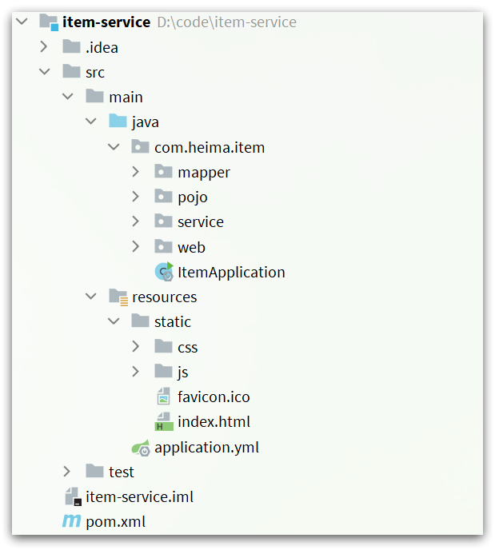
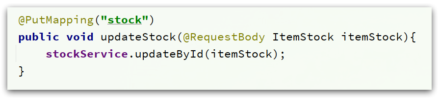
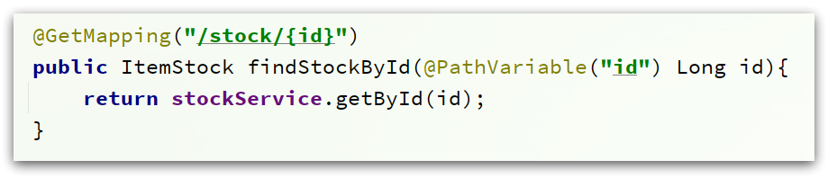

# 案例导入说明

**为了演示多级缓存，我们先导入一个商品管理的案例，其中包含商品的CRUD功能。我们将来会给查询商品添加多级缓存。**

***

## 目录

- [案例导入说明](#案例导入说明)
  - [目录](#目录)
  - [1.安装MySQL](#1安装mysql)
    - [1.1.准备目录](#11准备目录)
    - [1.2.运行命令](#12运行命令)
    - [1.3.修改配置](#13修改配置)
    - [1.4.重启](#14重启)
  - [2.导入SQL](#2导入sql)
  - [3.导入Demo工程](#3导入demo工程)
    - [3.1.分页查询商品](#31分页查询商品)
    - [3.2.新增商品](#32新增商品)
    - [3.3.修改商品](#33修改商品)
    - [3.4.修改库存](#34修改库存)
    - [3.5.删除商品](#35删除商品)
    - [3.6.根据id查询商品](#36根据id查询商品)
    - [3.7.根据id查询库存](#37根据id查询库存)
    - [3.8.启动](#38启动)
  - [4.导入商品查询页面](#4导入商品查询页面)
    - [4.1.运行nginx服务](#41运行nginx服务)
    - [4.2.反向代理](#42反向代理)

***

## 1.安装MySQL

***

后期做数据同步需要用到MySQL的主从功能，所以需要大家在虚拟机中，利用Docker来运行一个MySQL容器。
[Centos7安装Docker和MySQL](../Centos7安装Docker和MySQL/Centos7安装Docker.md)

***

### 1.1.准备目录

***

为了方便后期配置MySQL，我们先准备两个目录，用于挂载容器的数据和配置文件目录：

```shell
# 进入/tmp目录
cd /tmp
# 创建文件夹
mkdir mysql
# 进入mysql目录
cd mysql
```

***

### 1.2.运行命令

***

进入mysql目录后，执行下面的Docker命令：

```shell
docker run \
 -p 3306:3306 \
 --name mysql \
 -v $PWD/conf:/etc/mysql/conf.d \
 -v $PWD/logs:/logs \
 -v $PWD/data:/var/lib/mysql \
 -e MYSQL_ROOT_PASSWORD=123 \
 --privileged \
 -d \
 mysql:5.7.25
```

***

### 1.3.修改配置

***

在/tmp/mysql/conf目录添加一个my.cnf文件，作为mysql的配置文件：

```shell
# 创建文件
touch /tmp/mysql/conf/my.cnf
```

文件的内容如下：

```ini
[mysqld]
skip-name-resolve
character_set_server=utf8
datadir=/var/lib/mysql
server-id=1000
```

***

### 1.4.重启

***

配置修改后，必须重启容器：

```shell
docker restart mysql
```

***

## 2.导入SQL

***

接下来，利用Navicat客户端连接MySQL，然后导入课前资料提供的sql文件[item.sql](../Centos7安装Docker和MySQL/item.sql)：

<div align="center">
    
</div>

其中包含两张表：

- tb_item：商品表，包含商品的基本信息
- tb_item_stock：商品库存表，包含商品的库存信息

之所以将库存分离出来，是因为库存是更新比较频繁的信息，写操作较多。而其他信息修改的频率非常低。

***

## 3.导入Demo工程

***

下面导入课前资料提供的工程[item-service](../../../item-service/)：

<div align="center">
    
</div>

项目结构如图所示：

<div align="center">
    
</div>

其中的业务包括：

- 分页查询商品
- 新增商品
- 修改商品
- 修改库存
- 删除商品
- 根据id查询商品
- 根据id查询库存

业务全部使用mybatis-plus来实现，如有需要请自行修改业务逻辑。

***

### 3.1.分页查询商品

***

在`com.heima.item.web`包的`ItemController`中可以看到接口定义：

<div align="center">
    
</div>

***

### 3.2.新增商品

***

在`com.heima.item.web`包的`ItemController`中可以看到接口定义：

<div align="center">
    
</div>

***

### 3.3.修改商品

***

在`com.heima.item.web`包的`ItemController`中可以看到接口定义：

<div align="center">
    
</div>

***

### 3.4.修改库存

***

在`com.heima.item.web`包的`ItemController`中可以看到接口定义：

<div align="center">
    
</div>

***

### 3.5.删除商品

***

在`com.heima.item.web`包的`ItemController`中可以看到接口定义：

<div align="center">
    
</div>

这里是采用了逻辑删除，将商品状态修改为3

***

### 3.6.根据id查询商品

***

在`com.heima.item.web`包的`ItemController`中可以看到接口定义：

<div align="center">
    
</div>

这里只返回了商品信息，不包含库存

***

### 3.7.根据id查询库存

***

在`com.heima.item.web`包的`ItemController`中可以看到接口定义：

<div align="center">
    
</div>

***

### 3.8.启动

***

注意修改application.yml文件中配置的mysql地址信息：

<div align="center">
    
</div>

需要修改为自己的虚拟机地址信息、还有账号和密码。

修改后，启动服务，访问：<http://localhost:8081/item/10001即可查询数据>

***

## 4.导入商品查询页面

***

商品查询是购物页面，与商品管理的页面是分离的。

部署方式如图：

<div align="center">
    
</div>

我们需要准备一个反向代理的nginx服务器，如上图红框所示，将静态的商品页面放到nginx目录中。

页面需要的数据通过ajax向服务端（nginx业务集群）查询。

***

### 4.1.运行nginx服务

***

这里我已经给大家准备好了nginx反向代理服务器和静态资源。

我们找到课前资料的[nginx目录](../../../item-service/nginx-1.18.0/)：

<div align="center">
    
</div>

将其拷贝到一个非中文目录下，运行这个nginx服务。

运行命令：

```powershell
start nginx.exe
```

然后访问 <http://localhost/item.html?id=10001>即可：

<div align="center">
    
</div>

***

### 4.2.反向代理

***

现在，页面是假数据展示的。我们需要向服务器发送ajax请求，查询商品数据。

打开控制台，可以看到页面有发起ajax查询数据：

<div align="center">
    
</div>

而这个请求地址同样是80端口，所以被当前的nginx反向代理了。

查看nginx的conf目录下的nginx.conf文件：

<div align="center">
    
</div>

其中的关键配置如下：

<div align="center">
    
</div>

其中的192.168.150.101是我的虚拟机IP，也就是我的Nginx业务集群要部署的地方：

<div align="center">
    
</div>

完整内容如下：

```conf

#user  nobody;
worker_processes  1;

events {
    worker_connections  1024;
}

http {
    include       mime.types;
    default_type  application/octet-stream;

    sendfile        on;
    #tcp_nopush     on;
    keepalive_timeout  65;

    upstream nginx-cluster{
        server 192.168.150.101:8081;
    }
    server {
        listen       80;
        server_name  localhost;

 location /api {
            proxy_pass http://nginx-cluster;
        }

        location / {
            root   html;
            index  index.html index.htm;
        }

        error_page   500 502 503 504  /50x.html;
        location = /50x.html {
            root   html;
        }
    }
}
```

***
